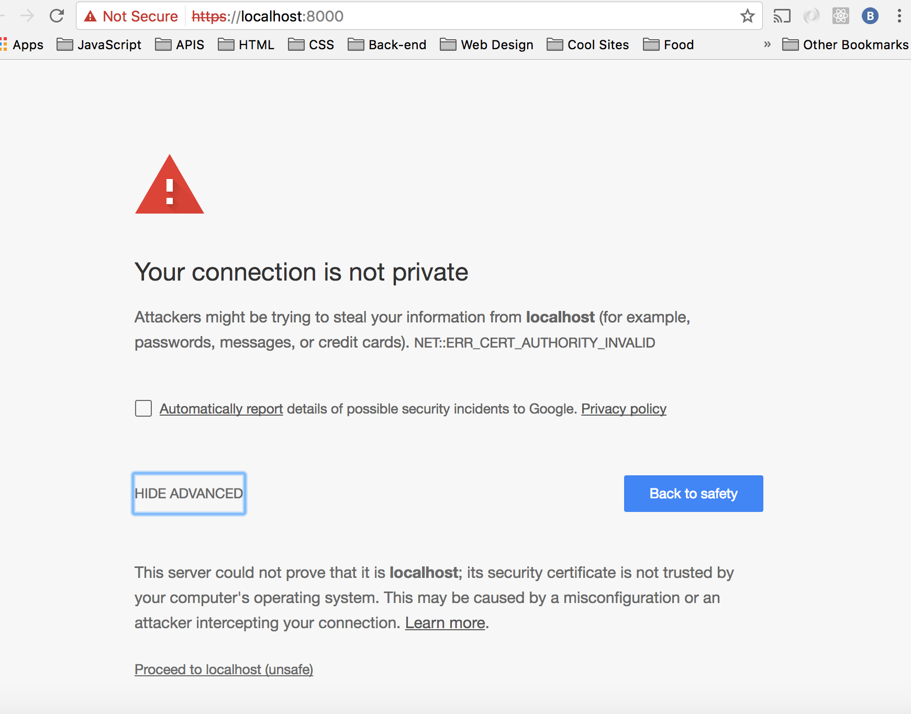
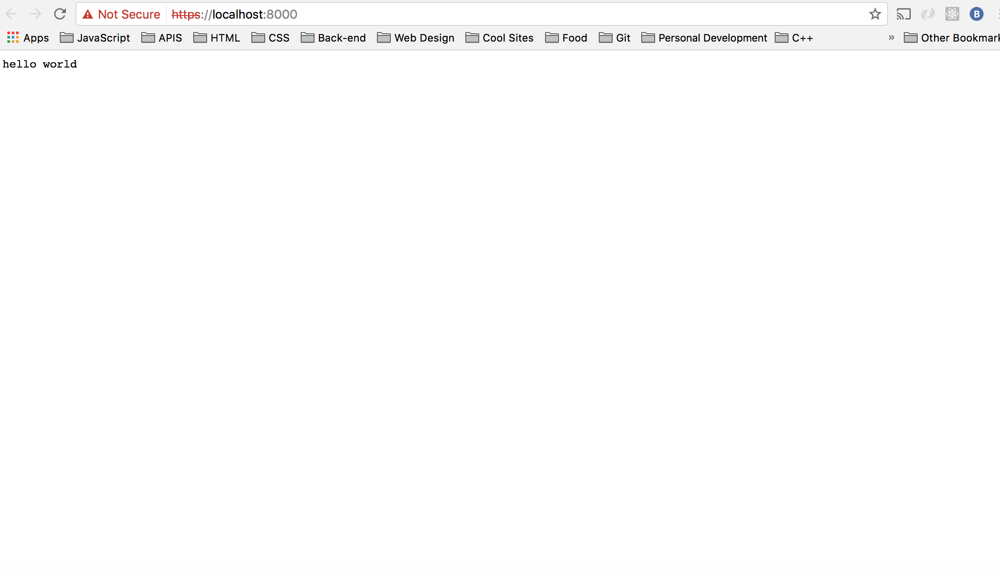

# WebRTC Workshop

## Goal

Throughout the workshop you'll learn how to extract your local media (webcam & microphone),
and create local/network based connections to other browsers (on the same network) to establish a
real time exchange of media (i.e. a video chat).

You'll (mostly) be writing code *without* use of frameworks, and make use of abstractions
to separate underlying technical details with Object Oriented programming,
making use of **Classes** (ES6) in JavaScript.

You'll also by making use of **Promises** (ES6) as an alternative to the more common *callback*
methodology for dealing with asynchronous events.

You'll be building an app targeted towards the latest browsers that support WebRTC, and
as a *side-effect* of that you'll be free to write full ES6 code on both the server-side and
client-side.

## 0. Setup (clone this repo)

- [x] Initial Setup (setup for you in this repo)

- [Cert generation for HTTPS]((https://docs.nodejitsu.com/articles/HTTP/servers/how-to-create-a-HTTPS-server/))

```
openssl req -newkey rsa:2048 -new -nodes -x509 -days 3650 -keyout key.pem -out cert.pem

mv cert.pem certs/cert.pem && key.pem certs/key.pem
```
- Start Server: `npm run start`
- Visit `https://localhost:8000`, then click Proceed to localhost(unsafe) in Advanced





## 1. Day 1 - Sending messages between components, streaming media (webcam & audio)  

1. From the boilerplate code in this repo, build a simple Node server that serves a
single index.html view (on GET request to '/').
2. This html file should source two JS assets; *adapter.js* (included in this repo) and
*app.js* (which you should create) at the bottom of the `<body>` tag. Assert that these assets
are loaded in when the index.html view is served.
3. In the html file, create 4 *VideoEndpoint* components (non-functional).
   These components should contain;
   - A unique ID name.
   - A child `<select>` element (empty for now).
   - Two child `<video>` elements, one for displaying your *own* webcam stream, another to display
a *remote* webcam stream.
   - A child `<button>` element, with **send** as text content.
4. In *app.js*, create a global *Endpoints* object, to store unique *Endpoint* objects;
5. In *app.js*, create a *class* for creating an *Endpoint* object, containing;
   - **Properties**;
      - *name*: (set by the class constructor).
   - **Methods**;
      - *send*: with arguments **to**, **method**, **message**. This method is called when
        an **Endpoint** would like to send a message to another *Endpoint* (by finding it
        in the global **Endpoints** object). The method will be a string, and the message will be a string or an object (consider converting it to a string before sending).
      - *receive*: with arguments **from**, **method**, **message**. This is called when
        an **Endpoint** receives a message from another Endpoint.
      - *register*: a method called when a new **Endpoint** instance is created, to register
         the instance in the global *Endpoints* object.
5. In *app.js*, establish functionality of your html *VideoEndpoint* components, by
   - Creating 4 *Endpoint* **instances**, using the *names* of your *VideoEndpoint* components
   when initialising.
   - For each **instance**, look up the *other* **Endpoint** names in the global *Endpoints* object,
   then use those names to inject `<option>` tags within the associated *VideoEndpoint* component's
   `<select>` tag. Test this has worked by clicking on each *VideoEndpoint*s `<select>` menu to check
   that *only* the names of the other *Endpoints* are in there.
   - When selecting the name of an *Endpoint* from a *VideoEndpoint's* `<select>` tag, clicking
   the **call** button should-
      - Send a message to that *Endpoint* instance, with the method *"CALL_REQUEST"*, and an empty
      message.
      - The other *Endpoint's* **receive** function should be triggered, so modify the *Endpoint*
      class's **receive** function to check for the "CALL_REQUEST" method, and log the following
      to the console;
         - Which endpoint *sent* the message.
         - Which endpoint *received* the message.
         - What the *method* was.
         - What *message* was.
6. You've created a local signalling network- congrats! Now let's finish by;
   - When clicking a *VideoEndpoints* **send** button, get your *Local Media Stream*
   from your webcam and stream it into the *VideoEndpoint* components **own** video
   element. You should be prompted to allow access to your *camera* and *audio*, and
   when you *Allow* your webcam stream should be displayed.


BONUS EXERCISE: Break *Endpoint* into two by;
   - Creating *Endpoint* as a *base* class, with *name* property, and *send* and *register*
    methods only.
   - Creating *VideoEndpoint* as a *sub* class of *Endpoint*, with *receive* method inside.
This will help in the next stages of the workshop, as the *send* method and *receive* method
will have a divergence of responsibilities...
